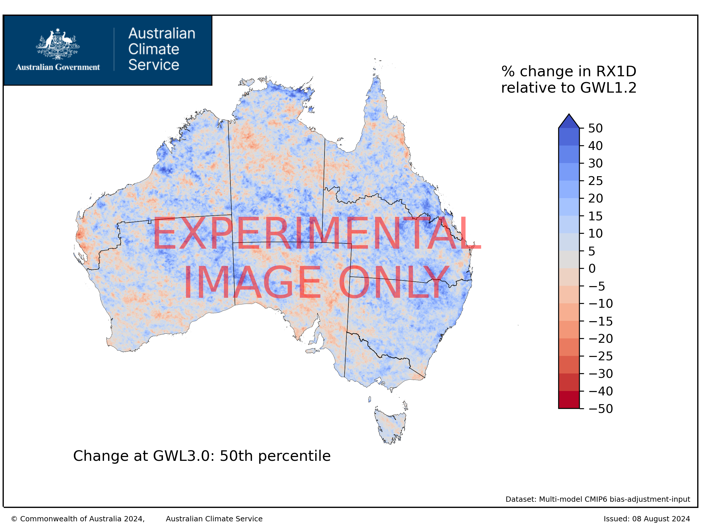

# ACS Hazard Team on Extratropical Storms
Last update: 20/06/2024

## Description
GitHub repository for ACS Hazard Team on Extratropical Storms to store, track and develop code. 

## Indices considered by the hazard team:
- Proportion of observations influenced by a low
- Highest annual 24 hour total (RX1D)
- Highest annual 5-day total (RX5D)
- Highest annual hourly total (RX1H)

## Products:
Status of the NCRA deliverables. 

The three dots (in order from first/top/left to last/bottom/right) represent the datasets used to compute indices:
- Dot 1: Pre-processed BARPA/CCAM – downscaled but NOT bias-corrected, 5 km (deliverable for 30 June)
- Dot 2: Bias-corrected BARPA/CCAM – downscaled AND bias-corrected, 5 km (deliverable for 31 July)
- Dot 3: National Hydrological Projections (NHP1.0) based on CMIP5 – bias-corrected, 5km
  
Note that bias correction is not available for pressure data or sub-daily data
 
In terms of the colors:
- :green_circle: The data is available in its final official form
- :yellow_circle: The data creation is currently in progress and available soon
- :red_circle: The data processing has not yet started
- :white_circle: Not intended for delivery/not applicable

| Index/metric | time series (ts) | GWLs 2D | MME 2D | MME 2D change | (Notes) |
|-----         | :-:              |:-:      |:-:     |:-:            |:-:    |
| low_freq|:green_circle: |:green_circle: |:green_circle: |:green_circle: |deliverable for 30 June N/A N/A|
| RX1D |:green_circle: :yellow_circle: :yellow_circle:|:green_circle: :red_circle: :white_circle:|:green_circle: :red_circle: :white_circle:|:green_circle: :red_circle: :white_circle:|deliverable for 30 June deliverable for 31 July N/A|
| RX5D |:green_circle: :yellow_circle: :yellow_circle:|:green_circle: :red_circle: :white_circle:|:green_circle: :red_circle: :white_circle:|:green_circle: :red_circle: :white_circle:||deliverable for 30 June deliverable for 31 July N/A|
| RX1H |:green_circle: |:green_circle: |:green_circle: |:green_circle: |deliverable for 30 June N/A N/A|

## Data location
/g/data/ia39/ncra/extratropical_storms/

## Summary statistics

This table gives the Australian average of the median % change between values at GWL1.2 and at GWLs 1.5, 2, and 3.

Notes:
- The data in this table has not been bias corrected; models may have large biases in their simulation of the current climate 
- The change factors for each percentile are averaged across the whole of Australia - note that this can give slightly *smaller changes* and a *larger range of uncertainty* when compared to changes calculated from regional mean timeseries, as these datasets can have very large interannual variability at individual locations.
- For the case of low frequency, "Australian" averages are calculated only for latitudes south of 30S, to avoid contamination by trends in tropical lows
- GWL1.2 represents the "current climate", centred around 2020. Changes in indices have already occurred between the current climate and historical values such as 1961-1990/

| Index/metric | GWL1.5 | GWL2 | GWL3 | (Notes) |
|-----         | :-:    |:-:   |:-:   |-----    |
| low_freq*|-5.5% (-16% to +12%)|-9.0% (-24% to +11%)|-12.8% (-32.7% to +2.4%)|*calculated for locations south of 30S|
| RX1D |-0.2% (-16% to +19%)|+1.9% (-21% to +32%)|+7.9% (-18% to +41%)||
| RX5D |-0.8% (-16% to +17%)|+0.6% (-21% to +28%)|+5.8% (-18% to +36%)||
| RX1H |+0.8% (-11% to +14%)|+3.2% (-14% to +24%)|+10.2% (-9% to +34%)||

| RX1D | Low frequency |
|----- |-----    |
| |-----    |
|Multi-model median of the % change in RX1D between GWL1.2 and GWL3 |Multi-model median of the % change in low frequency between GWL1.2 and GWL3 |

## Authors and acknowledgment
Hazard team:
- [ ] Acacia Pepler (BOM, lead)
- [ ] James Risbey (CSIRO, alternate lead)

## Details on extratropical lows

Lows are initially identified as individual cyclone centres at a single atmospheric level, and can have a range of intensities.
 For the purposes of this intial dataset we include:
- Surface lows that have closed circulation and persist for at least 6 hours
- Which have a matching low at 500hPa within 500km at least once
  
Any grid point within a 5 degree (500km radius) of the low centre is considered to be influenced by the low. 
 This is used to calculate what proportion of all 6-hourly observations are influenced by a low.
 Note that this tracking does not disinguish between extratropial lows or tropical lows (including but not limited to tropical cyclones)

## Details of code 

This is a directory of code developed by the NCRA Extratropical Storm Hazard Team

The early files are a dump of code used to create preliminary maps of extratropical storms and extreme rainfall as part of the NCRA Extratropical Storm Hazard Team 2-pagers

The files uploaded in June 2024 were used to develop the MVP grids stored in /g/data/ia39/ncra/extratropical_storms/

Shell scripts based on cdo are used to extract annual RX1D, RX5D, and RX1H datasets from the raw files. 
- run_rx5d_5km.sh is the main file for the MVP RX1D/RX5D datasets, while run_rx5d_NHP.sh applies the same methods to the older NHP data and run_rx5d_5km_biasadj.sh applies the same methods to the bias corrected datasets (QME and MRNBC)
- As there is no 5km hourly data, the RX1H is first calculated on the native grid (e.g. run_rx1h_barpa_v3.sh, run_rx1h_ccam_v3.sh, run_rx1h_qld.sh) and then regridded to 5km using CDO (regrid_RX1H_5km.sh)
- Lows are tracked using a different set of code from https://github.com/apepler/cyclonetracking, and the raw track files at from https://github.com/apepler/cyclonetracking were converted to annual grids using R, extract_gridded_lows.R. This is performed on a 1 degree grid by default, and regridded to 5km using regrid_lows_5km.sh

In addition, there are preliminary code for calculating GWL grids and generating figures; these are likely to be replaced by python code in future versions.
- extract_grids_annmean_regs_tocsv.R takes annual gridded datasets and converts them to annual timeseries of means for each NCRA region
- generate_GWL_grids_5km.ncl generates netCDF grids for different GWLs using the 13-membr ACS ensemble
- analyse_GWL_plots_5km.ncl uses the same process but generates plots instead of aving the netCDF grids

